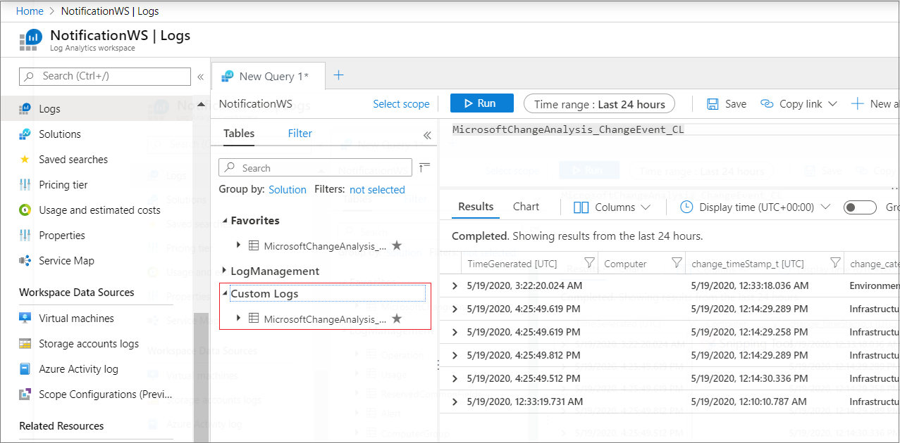

# Enable Change Notifications Private Preview - Application Change Analysis

The following steps explain how to enable change notifications private preview on your Azure subscription and how to configure an Azure Monitor alert on specific changes.

## Pre-requisites
* You should have an Azure subscription. 
    * [Create your Azure free account today](https://azure.microsoft.com/en-us/free/)
* Email changeanalysisteam@microsoft.com with your subscription ID to enable notifications
* [Install Azure PowerShell Az module](https://docs.microsoft.com/en-us/powershell/azure/new-azureps-module-az?view=azps-3.8.0#upgrade-to-az)
* [Create a Log Analytics workspace in the Azure portal](https://docs.microsoft.com/en-us/azure/azure-monitor/learn/quick-create-workspace)

## Enable notifications
* Download this script
    * Clone this repository to get [ChangeNotifications.ps1](https://github.com/CawaMS/EnableChangeNotifications/blob/master/ChangeNotifications.ps1)
* Obtain values for the following parameters from your Azure subscription and Log Analytics workspace
    * **Subscription ID**
    * **Workspace ID**
        * Go to Log Analytics workspace. Choose Properties Menu item and copy workspace ID. See **Figure 1**
    * **Workspace resource ID**
        * Go to Log Analytics workspace. Choose Properties Menu item and copy workspace ID. See **Figure 1**
    
    **Figure 1: Get workspace properties**

    

    * **Location**
        * Use the location for your Log Analytics workspace
    * **IncludeChangeDetails** – anyone who has READ access to the workspace may potentially see sensitive information (the old/new value. i.e. connection string) for the workspace from the old/new values field. Including the details in the change event will enable you to view it in the alert itself. Otherwise you can use the deep link property in the change event to view the old/new values in Application Change Analysis service. 
    * **Enable/Disable notifications**
* Run the script
    * Launch a PowerShell command prompt
    * Login to your Azure account
    ```
    Connect-AzAccount
    ```
    *  *(Optional)* select your Azure subscription
    ```
    $context = Get-AzSubscription -SubscriptionId <your_subscriptionId>
    Set-AzContext $context
    ```
    * Use the parameters obtained above to run the script. You may have to set execution policy. Please refer to [About Execution Policies](https:/go.microsoft.com/fwlink/?LinkID=135170)
    ```
    .\ChangeNotifications.ps1  -SubscriptionId <your_subscriptionId>  -ActivationState Enabled -IncludeChangeDetails Include -WorkspaceId <your_workspaceId> -WorkspaceResourceId "<your_resourceId_keepTheDoubleQuotes>"  -Location <your_location>
    ```

## Test the notification
* Make a change by adding a slot to your web app
* Go to the Log Analytics workspace. You should see **MicrosoftChangeAnalysis_ChangeEvent_CL** under Custom Logs. Run a query to see results

    **Figure 2: view change events in Log Analytics workspace**

    


* Go to Alerts and configure a custom log alert on change. Refer to [Create, view, and manage log alerts using Azure Monitor](https://docs.microsoft.com/en-us/azure/azure-monitor/platform/alerts-log)
    * Based on if configured ‘include change details’, user can either see the old/new value or click on deep link


